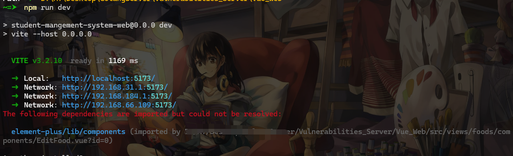

# 零 注意（Tips）

- 1.请勿将本系统用于开发项目，系统中存在许多漏洞，仅允许帮助安全研究人员和业余爱好者了解和掌握有关Golang系统的渗透测试和代码审计知识。

  1.Do not use this system for development projects, there are many vulnerabilities in the system, only allowed to help security researchers and hobbyists understand and master the penetration testing and code audit knowledge about the Golang system.

- 2.不得用于非法和犯罪活动。

  2.It shall not be employed for illegal and criminal activities.

- 3.不要用来提交CVE。

  3.Do not use to submit CVE.

# 壹 Vulnerabilities_Server

> 前段时间，在用`Golang`写`Web`服务时（通过代审的视角去了解`Golang`的`web`服务），发现需要考虑的问题很多，这些问题不仅仅包括运行的问题，还包括一些安全问题，当时就在网上找一些关于`Golang`的靶场来认识`Golang`的`web`服务有没有什么漏洞，但是发现，相对与`PHP`、`Java`这些语言的漏洞靶场，`goalng`的靶场实在是少之又少，所以就有了写一个`Golang`实战化靶场漏洞，因为觉得单纯的去写一个列表式靶场，不如直接给个场景去探索和发现一个系统是怎么运作，怎么编写和逻辑实现的，这对于实际的漏洞挖掘和代码审计的学习可能更有帮助（个人感觉）。


这是一个用`Golang`写的`Web`靶场，该系统是以食谱菜单管理系统为场景去编写，一种实战化形式的安全漏洞靶场，其中存在多个安全漏洞，需要我们去探索和发现。该项目旨在帮助安全研究人员和爱好者了解和掌握关于`Golang`系统的渗透测试和代码审计知识。

项目后面的设想是以这个场景为出发点扩展出其他语言的漏洞靶场，目前只写了`Golang`语言的漏洞靶场，后面会持续更新，如果您觉得Vulnerabilities_Server对你有些许帮助，请加个⭐，您的支持将是Vulnerabilities_Server前进路上的最好的见证！

后端使用`Gin`框架，前端使用`Vue`框架（我前端太菜了，借用了开发大佬项目[student-mangement-system-web](https://github.com/seasonl2014/student-mangement-system-web)前端魔改的


# 贰 Vulnerability

目前有这些漏洞，如果有好的`idea`漏洞，可以提个`issues`给我，我来加：

```bash
- 用户名枚举：
登录处存在

- 验证码：
万能验证码

- 任意密码修改
密码修改处

- 命令执行：
ping处

- 暴力破解
登录处存在

- SQL注入：
订单查询处,添加菜品

- 文件上传（不能getshell）
所有的文件上传功能点


- 未授权
home目录，未授权获取敏感信息，swagger未授权

- 越权漏洞
水平和垂直越权

- 文件下载、删除和读取，这里就是一个路径穿越
数据库文件下载和删除功能

- SSRF
获取名言金句功能

- 目录遍历
获取数据库文件功能

- JWT
密钥为空

- 敏感信息泄露：
前端信息泄露，日志功能

- 负值反冲
修改价格处

- 模板注入
原生模板的测试功能

- ZIP的漏洞
测试性功能处
```

# 叁 部署

- `Golang`后端

创建一个`go_server_db`的`mysql`数据库

如果有`golang`环境的话，直接在`Go_Server`主目录下运行：

```bash
go run .
```

如果没有`golang`环境的话，可根据不同操作系统下载对应的可执行文件，然后运行即可。

- `Vue`前端

如果有`node`环境的话直接，运行`npm install`下载组件即可。可能会出现下面这种情况，可以忽略：



如果没有`node`环境的话，直接用后端的`swagger`即可运行。

```bash
http://localhost:8081/swagger/index.html
```

