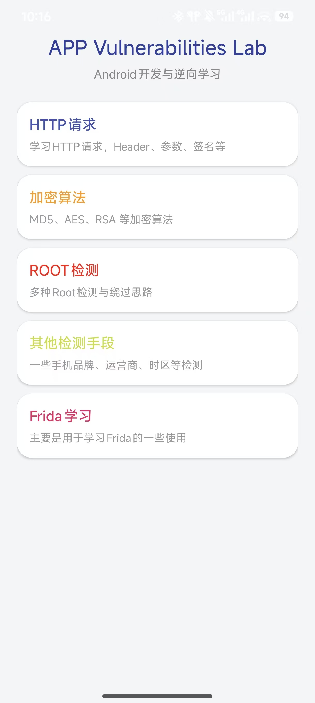
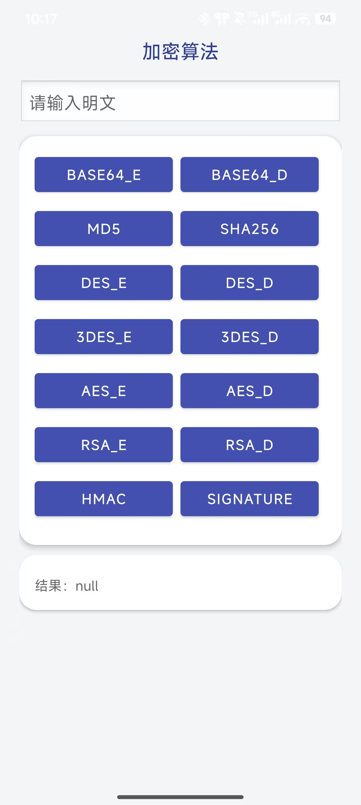
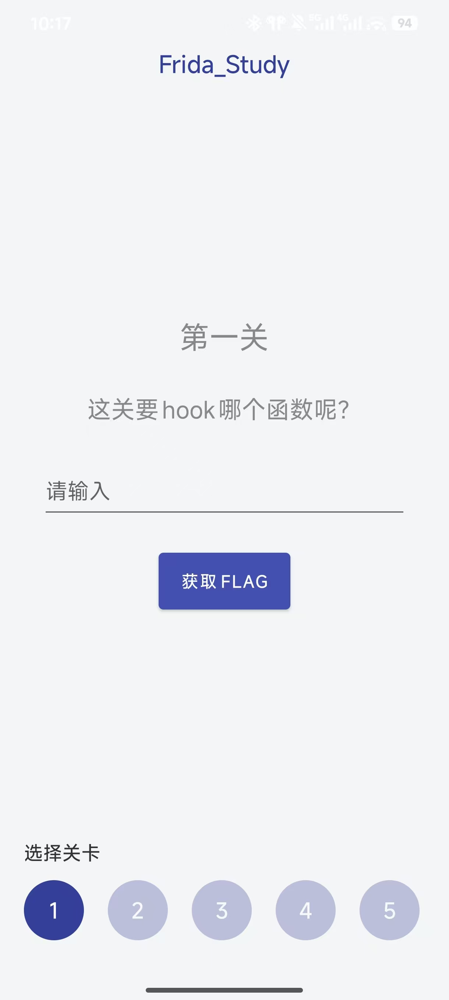

# 零 注意（Tips）

- 1.请勿将本系统用于开发项目，系统中存在许多漏洞，仅允许帮助安全研究人员和业余爱好者了解和掌握有关系统的渗透测试和代码审计知识。

  1.Do not use this system for development projects, there are many vulnerabilities in the system, only allowed to help security researchers and hobbyists understand and master the penetration testing and code audit knowledge about the Golang system.

- 2.不得用于非法和犯罪活动。

  2.It shall not be employed for illegal and criminal activities.

- 3.不要用来提交CVE。

  3.Do not use to submit CVE.

# 壹 Vulnerabilities_Server

> 前段时间，在用`Golang`写`Web`服务时（通过代审的视角去了解`Golang`的`web`服务），发现需要考虑的问题很多，这些问题不仅仅包括运行的问题，还包括一些安全问题，当时就在网上找一些关于`Golang`的靶场来认识`Golang`的`web`服务有没有什么漏洞，但是发现，相对与`PHP`、`Java`这些语言的漏洞靶场，`goalng`的靶场实在是少之又少，所以就有了写一个`Golang`实战化靶场漏洞，因为觉得单纯的去写一个列表式靶场，不如直接给个场景去探索和发现一个系统是怎么运作，怎么编写和逻辑实现的，这对于实际的漏洞挖掘和代码审计的学习可能更有帮助（个人感觉）。至此出现了最开始的`Golang`靶场。
>
> 后来发现既然要做用于代码审计和漏洞挖掘的，那为何不做个多语言实战靶场，虽然场景差不多，但是也可以通过编程语言了解其语言本身的特性和审计思路，同时也会加入一些在`src`中出现的漏洞，可以当作`src`靶场练手。

这是一个集合了多种语言的实战化Web靶场，该系统是以食谱菜单管理系统为场景去编写，一种实战化形式的安全漏洞靶场，其中存在多个安全漏洞，需要我们去探索和发现。该项目旨在帮助安全研究人员和爱好者了解和掌握关于不同语言系统的渗透测试和代码审计知识，如果有好的有意思的漏洞点或者提交src时有不错的漏洞想法，可以提个issue。后面打算再加一些其他的场景进去，在进行代码审计/漏洞挖掘/src教学时就有靶场去练习了。

项目地址：https://github.com/A7cc/Vulnerabilities_Server

项目后面的设想是以这个场景为出发点扩展出其他语言的漏洞靶场，目前只写了`Golang`、`Python`语言的漏洞靶场，后面会持续更新，如果您觉得`Vulnerabilities_Server`对你有些许帮助，请加个⭐，您的支持将是`Vulnerabilities_Server`前进路上的最好的见证！


# 贰 Vulnerability

不同语言靶场漏洞可能不同这里的漏洞情况，只在对应漏洞靶场的文件夹处显示。目前支持的漏洞靶场：

- Golang靶场
- Python靶场
- 前端靶场加解密
- APP逆向靶场（最近在学`APP`逆向，然后想的是`APP`的逆向以业务为驱动的话，覆盖的逆向破解手段比较少，所以这个靶场并不是业务靶场，后面如果有空的话再覆盖场景吧。。。）

# 叁 部署

- 后端

进入不同语言文件夹，查看`Readme.md`部署，然后部署的端口建议`8081`，因为前端访问的后台端口是`8081`（可以自己改）。目前至此的语言：

>Golang靶场：Go_Server文件夹
>
>Python靶场：Python_Server文件夹
>
>前端靶场加解密：Vue_Server文件夹
>
>APP逆向靶场：Vulnerabilities_APP文件夹

后续计划：

>Java靶场
>
>PHP靶场
>
>C#靶场
>
>不错的开源审计项目积累（这个以文件的形式输出，主要收集一些平时觉得适合做代码审计的开源项目）
>
>。。。。。。。。。

- `Vue`前端（可以算是靶场吧。。。加了一些密码学，可以学习`js`逆向）

如果有`node`环境的话直接，运行`npm install`下载组件即可。


接着输入命令`npm run dev`运行前端即可，可能会出现下面这种情况，可以忽略：


如果没有`node`环境的话，直接用后端的`swagger`即可运行。

```bash
http://localhost:8081/swagger/index.html
```

- `APP`靶场







# 肆 更新

- 2024/09：最开始的`Golang`靶场
- 2025/01：修复了`Golang`靶场的一些运行问题（非漏洞问题），添加了前端的加解密，添加了`Python`靶场（原本想的是写好一大把再上传，但是感觉还是慢工出细活好一点，慢慢的积累）

- 2025/02：忘记上传`vue`前端代码了，重新加载上去了

- 2025/03：增加了一些`vue`前端靶场的加密和一些信息泄露（可以学习`js`相关调试）

- 2025/12：修复了python靶场bug，新增了`APP`的逆向靶场，添加了docker（感谢[@zjxs-zzzcb](https://github.com/zjxs-zzzcb)）

- 2026/02：修复了加解密部分的`bug`，添加了加密模块`HMAC`、`Signature`，添加了`Frida`学习模块

# 伍  感谢各位师傅

## 5.1 Stargazers

[](https://github.com/A7cc/Vulnerabilities_Server/stargazers)


## 5.2 Forkers

[](https://github.com/A7cc/Vulnerabilities_Server/network/members)


## 5.3 Star History

[](https://starchart.cc/A7cc/Vulnerabilities_Server)

