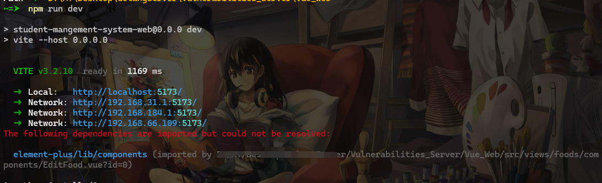

# 壹 Vulnerabilities_Server_Vue

这是一个用`JavaScript`写的前端靶场，该系统是以食谱菜单管理系统为场景去编写，一种实战化形式的安全漏洞靶场，其中存在多个安全漏洞，需要我们去探索和发现。该项目旨在帮助安全研究人员和爱好者了解和掌握关于`Vue`前端的渗透测试和代码审计知识。

当前代码为靶场的前端代码，使用`JavaScript`语言、`Vue`框架，后端的话，估计个人需求选择不同后端代码搭建。项目地址：https://github.com/A7cc/Vulnerabilities_Server

项目后面的设想是以这个场景为出发点扩展出其他语言的漏洞靶场，后面会持续更新，如果您觉得对你有些许帮助，请加个⭐，您的支持将是[`Vulnerabilities_Server`](https://github.com/A7cc/Vulnerabilities_Server)对你有些许帮助，请加个⭐，您的支持将是[`Vulnerabilities_Server`](https://github.com/A7cc/Vulnerabilities_Server)前进路上的最好的见证！


# 贰 Vulnerability

目前有这些加解密方式，如果有好的`idea`漏洞，可以提个`issues`给我，我来加：

```bash
登录：自定义加密

密码更新：AES-256-CBC

获取用户信息处：RSA

数据修改：3DES

ping功能：简单的替换+双base64

信息泄露：用户密码信息泄露

api泄露：一些乱七八糟的key
```

> 注意：可能会有其他漏洞，在写的时候由于突然的想法加但是没提出来，如果发现的话，帮忙提个`issues `（不是交`CVE`，用这个系统交`CVE`的是`SB`）。。。
> `Web`的用户名密码：`admin`/`hJ58F_Qr96LW`

# 叁 部署

- 后端

后端部署的话，用其他后端语言部署就行，看对应的文档即可。

- `Vue`前端

如果有`node`环境的话直接，运行`npm install`下载组件即可。可能会出现下面这种情况，可以忽略：



如果没有`node`环境的话，直接用后端的`swagger`即可运行。

```bash
http://localhost:8081/swagger/index.html
```

- `Docker`部署

后端直接在对应语言目录下执行：

```bash
docker-compose up -d
```

前端的话，直接在`Vue_Server`目录下执行：

```bash
docker-compose up -d
```